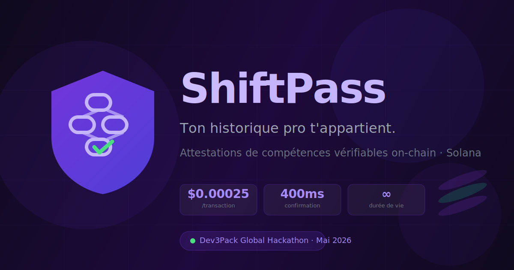

# ShiftPass

**Passeport professionnel portable pour travailleurs frontline, ancré sur Solana.**

> 130% de turnover en restauration rapide. À chaque départ, tout disparaît.  
> ShiftPass ancre tes compétences on-chain — vérifiables par n'importe quel recruteur, en 2 secondes, sans intermédiaire.



---

## Fonctionnalités

- **Attestations on-chain** — chaque compétence est ancrée via le Memo Program Solana (vérifiable publiquement sur l'explorateur)
- **Double signature** — l'employeur émet, l'employé confirme avec son wallet Phantom
- **Passeport portable** — lié au wallet de l'employé, accessible à vie via `/passport/:walletAddress`
- **Anti-fraude intégré** :
  - Vérification SIRET via l'API SIRENE gouvernementale (KYB)
  - Tenure minimum 14 jours avant attestation
  - Détection cross-attestation (deux personnes qui s'attestent mutuellement)
  - Blocage auto-attestation (même wallet employeur et employé)

---

## Stack

| Couche | Technologie |
|---|---|
| Frontend | React 19 + Vite 8 + TypeScript + TailwindCSS 3 |
| Auth & BDD | Supabase (Auth + PostgreSQL + RLS) |
| Blockchain | Solana devnet — Memo Program natif |
| Wallet | Phantom via `@solana/wallet-adapter` |
| Déploiement | Vercel |

---

## Installation

```bash
git clone https://github.com/HexaNexus28/Shiftpass.git
cd Shiftpass
npm install
```

### Variables d'environnement

Créer `.env.local` à la racine :

```env
VITE_SUPABASE_URL=https://[ref].supabase.co
VITE_SUPABASE_ANON_KEY=eyJ...

VITE_SOLANA_RPC=https://api.devnet.solana.com

# Pour les migrations
SUPABASE_DB_HOST=db.[ref].supabase.co
SUPABASE_DB_PORT=5432
SUPABASE_DB_NAME=postgres
SUPABASE_DB_USER=postgres
SUPABASE_DB_PASSWORD=...
```

> **Vercel** : ajouter `VITE_SUPABASE_URL` et `VITE_SUPABASE_ANON_KEY` dans Settings → Environment Variables, puis redéployer.

### Base de données

```bash
npm run migrate:dev
```

---

## Développement

```bash
npm run dev        # localhost:5173
npm run build      # TypeScript check + build
```

---

## Routes

| Route | Description |
|---|---|
| `/` | Landing page |
| `/employer` | Connexion / inscription manager → Dashboard |
| `/employee/:id` | Activation wallet par l'employé (lien envoyé par le manager) |
| `/passport/:wallet` | Passeport public vérifiable |

---

## Flux

```
Manager                              Employé
───────                              ───────
Inscription + SIRET (KYB)
Dashboard → Ajouter un employé  →   Reçoit lien /employee/:id
                                     Connecte wallet Phantom
Émettre une attestation
  sha256(payload)
  sendMemoTransaction()         →   TX Memo on-chain (Solana)
  INSERT attestation (DB)
                                     Bouton Confirmer
                                     signMessage(hash)     →   employee_signature (DB)
                                     verified = true ✓
                                     /passport/:wallet public
```

---

## Liens

- [Explorer Solana devnet](https://explorer.solana.com/?cluster=devnet)
- [Phantom Wallet](https://phantom.app)
- [Faucet SOL devnet](https://faucet.solana.com)
- [Supabase Dashboard](https://supabase.com/dashboard/project/poknblfcdvnipoqfsrgr)
- [API SIRENE](https://recherche-entreprises.api.gouv.fr)
